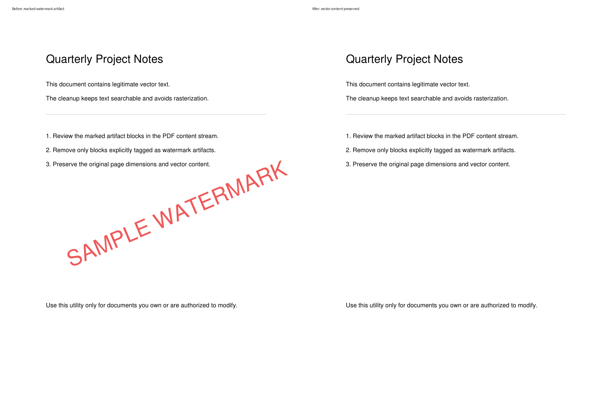
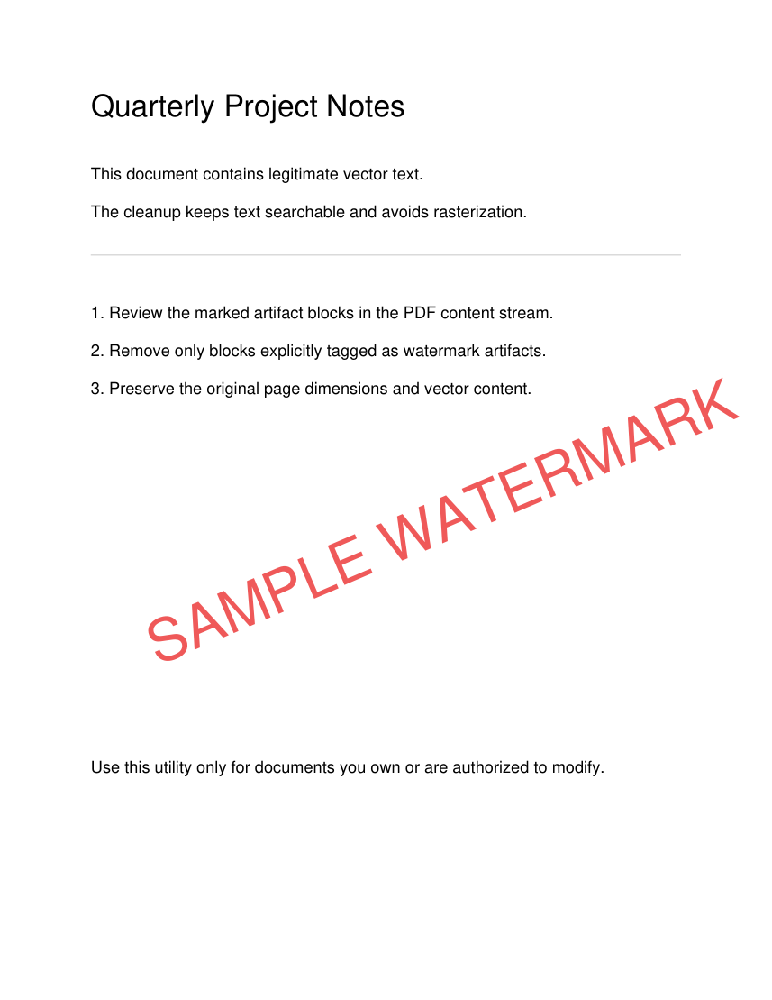
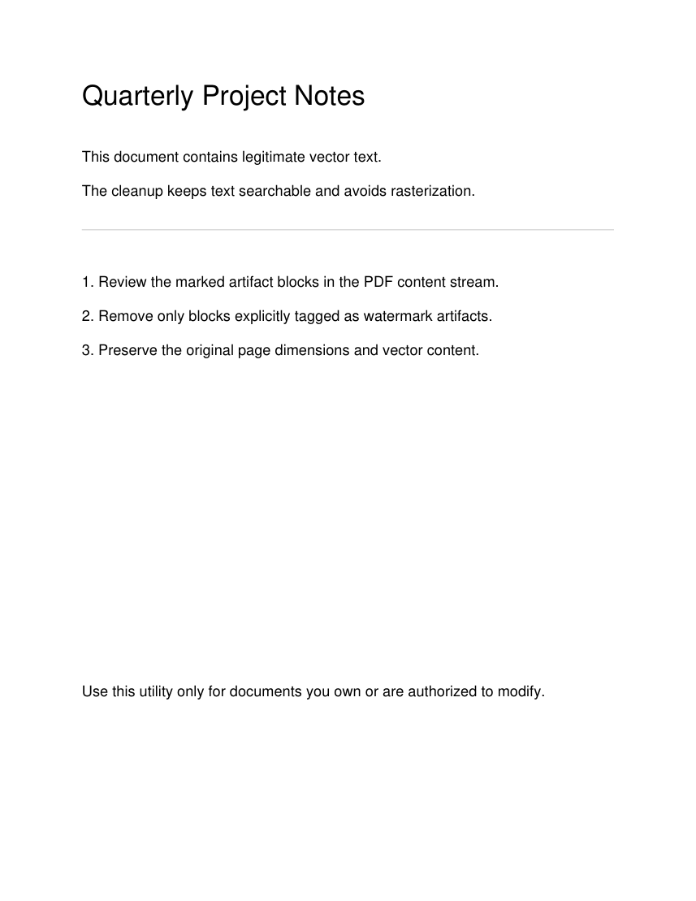
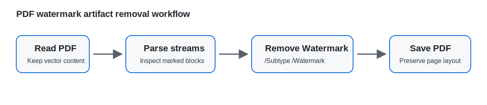

# PDF Watermark Artifact Remover

[English](../README.md) | 简体中文

这个命令行工具用于删除 PDF 内容流中明确标记为水印的 Artifact：

```text
/Artifact << /Subtype /Watermark >> BDC
...
EMC
```

它直接编辑 PDF 内容流，不会把页面转换成图片，不会降低清晰度，也不会使用矩形覆盖方式误删与水印重叠的正文。



<table>
  <tr>
    <th>处理前</th>
    <th>处理后</th>
  </tr>
  <tr>
    <td></td>
    <td></td>
  </tr>
</table>

## 适用范围

适合处理：

- PDF 软件添加的标准水印层；
- 标记为 `/Subtype /Watermark` 的文字或矢量水印；
- 需要保留原始页面尺寸、矢量内容和可搜索文本的文档。

不适合处理：

- 扫描图片中已经合成的水印；
- 未标记为 Watermark Artifact 的普通文本或图形；
- 印章、签名或正文内容。

请仅处理你拥有版权或已获得授权的文档。

## 安装

```bash
git clone https://github.com/Yahuicai/pdf-watermark-artifact-remover.git
cd pdf-watermark-artifact-remover

python3 -m venv .venv
source .venv/bin/activate
python -m pip install .
```

Windows PowerShell 激活虚拟环境：

```powershell
.venv\Scripts\Activate.ps1
```

## 使用方法

处理全部页面：

```bash
pdf-remove-marked-watermarks input.pdf output-clean.pdf
```

先生成第一页预览：

```bash
pdf-remove-marked-watermarks input.pdf preview.pdf \
  --pages 1 \
  --only-selected
```

仅处理指定页面，但保留完整文档：

```bash
pdf-remove-marked-watermarks input.pdf output-clean.pdf \
  --pages 1,3-5
```

## 工作原理



```text
读取 PDF
  -> 解析每页内容流
  -> 找到 /Subtype /Watermark Artifact
  -> 删除对应 marked-content block
  -> 保存新的 PDF
```

由于只删除明确标记的水印块，正文、图片、图表和页面尺寸都会保留。

## 演示文件

仓库包含可公开、可复现的演示文件：

- [`examples/demo-watermarked.pdf`](../examples/demo-watermarked.pdf)
- [`examples/demo-clean.pdf`](../examples/demo-clean.pdf)

重新生成演示素材：

```bash
python -m pip install -e '.[dev,demo]'
python scripts/generate_demo_assets.py
```

## 开发与测试

```bash
python -m pip install -e '.[dev]'
pytest
```

## 来源与许可证说明

请查看 [ATTRIBUTIONS.md](../ATTRIBUTIONS.md)。其中区分了：

- 实际使用的第三方依赖；
- 仅用于生成演示图片的可选依赖；
- 调研阶段评估过、但没有复制代码或素材的仓库。
